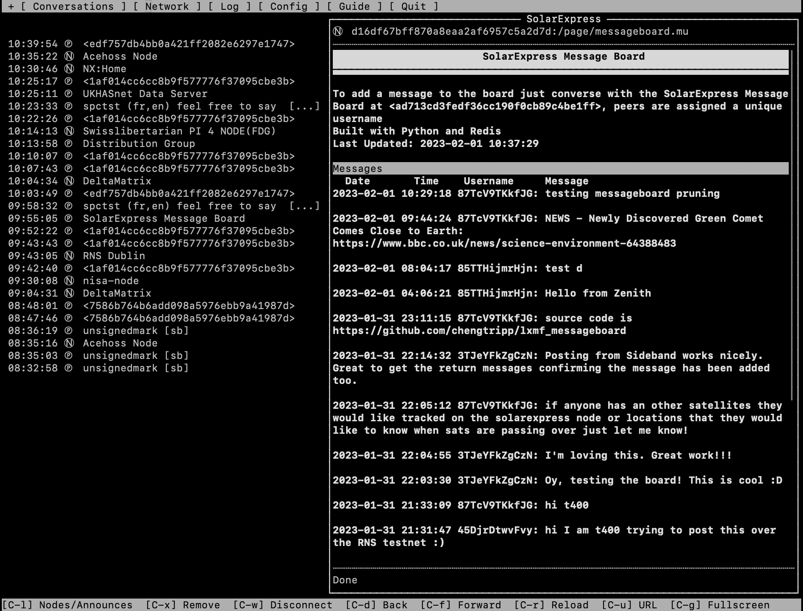

# lxmf_messageboard
Simple message board that can be hosted on a NomadNet node, messages can be posted by 'conversing' with a unique peer, all messages are then forwarded to the message board.

## How Do I Use It?
A user can submit messages to the message board by initiating a chat with the message board peer, they are assigned a unique username (generated randomly using the shortuuid library) and their messages are added directly to the message board. The message board can be viewed on a page hosted by a NomadNet node.

An example message board can be found on the reticulum testnet hosted on the SolarExpress Node `<d16df67bff870a8eaa2af6957c5a2d7d>` and the message board peer `<ad713cd3fedf36cc190f0cb89c4be1ff>`

## How Does It Work?
The message board page itself is hosted on a NomadNet node, you can place the message_board.mu into the pages directory. You can then run the message_board.py script which provides the peer that the users can send messages to. The two parts are joined together with a redis database in the background.

## Credits
* The send and receive functions in message_board.py are based on examples posted on the Reticulum Matrix channel by [Mark](https://github.com/markqvist)
